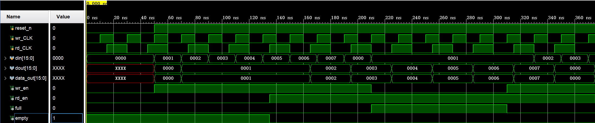

# 异步FIFO

## 功能
- 跨时钟域数据传输
- 写时钟域 wr_CLK，读时钟域 rd_CLK
- 深度：8，位宽：16
- 提供满标志 full 和空标志 empty

## 设计要点
- 存储阵列 reg [width-1:0] mem [depth-1:0]
- 二进制写指针 wr_add，格雷码写指针 wp
- 二进制读指针 rd_add，格雷码读指针 rp
- 两级触发器同步格雷码指针到另一时钟域
- 空判断：同步后的写指针 rd1_wp == 读指针 rp
- 满判断：同步后的读指针 wr1_rp 高2位取反 == 写指针 wp 高2位

## 端口列表
- reset_n：输入，异步复位，低电平有效
- wr_CLK：输入，写时钟
- rd_CLK：输入，读时钟
- din：输入，写数据，位宽16
- wr_en：输入，写使能
- rd_en：输入，读使能
- dout：输出，读数据，位宽16
- full：输出，满标志
- empty：输出，空标志

## 文件说明
- p_fifo.v：异步FIFO设计代码
- p_fifo_tb.v：仿真testbench

## 仿真验证
- 写时钟 50MHz，读时钟 33.3MHz
- 写数据 0 到 7 循环
- 写满时 full 拉高，读空时 empty 拉高
- 读出数据与写入数据一致

## 仿真波形

