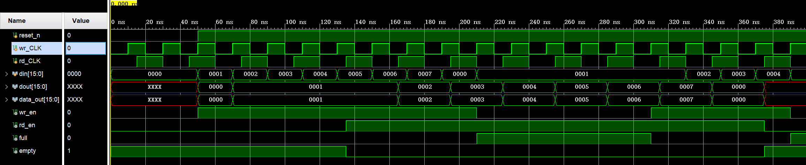

# 异步FIFO

## 设计功能

- 跨时钟域数据传输，写时钟和读时钟独立
- 深度8，数据位宽16bit
- 满标志full，空标志empty
- 格雷码指针同步，解决跨时钟域亚稳态

## 设计思路

- 双端口RAM：写端口在wr_CLK域，读端口在rd_CLK域
- 格雷码指针：二进制转格雷码，相邻状态只有1bit变化
- 跨时钟域同步：读写指针各经两级触发器同步到对方时钟域
- 空满判断：空（读指针追上写指针），满（写指针比读指针多绕一圈）

## 端口

- reset_n：输入，异步复位，低电平有效
- wr_CLK：输入，写时钟
- rd_CLK：输入，读时钟
- din：输入，写数据，位宽16
- wr_en：输入，写使能
- rd_en：输入，读使能
- dout：输出，读数据，位宽16
- full：输出，满标志
- empty：输出，空标志

## 关键参数

- width：数据位宽，默认16
- depth：FIFO深度，默认8

## 文件说明

- Asy_FIFO.v：异步FIFO设计代码
- Asy_FIFO_tb.v：仿真testbench
- Async_FIFO.png：仿真波形图

## 仿真验证

- 写时钟50MHz，读时钟33.3MHz
- 写数据0到7循环
- 写满时full拉高，读空时empty拉高
- 读出数据与写入数据一致

## 综合结果

使用Vivado完成FPGA综合：
- Slice LUTs：26
- Slice Registers：26
- LUT as Distributed RAM：12

## 后续优化

- 支持参数化深度和位宽
- 添加almost_full/almost_empty标志
- 使用专用SRAM宏替代分布式RAM

## License

MIT License
